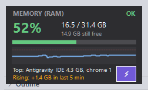

<p align="center">
  
</p>

<h1 align="center">RAM Monitor</h1>

<p align="center">
  A lightweight, always-on-top RAM monitoring widget for Windows with spike auto-analysis
  and safe one-click memory optimization.<br>
  <b>One PowerShell script. Zero dependencies. Nothing to install.</b>
</p>

<p align="center">
  
</p>

---

## Why

Windows Task Manager tells you how much RAM is in use *right now*, but not **what caused the spike five minutes ago** while you were busy working. RAM Monitor watches continuously, and when usage crosses your alert threshold it automatically diffs the last few minutes of per-process history and tells you exactly which process ballooned — then gives you one-click, guard-railed ways to deal with it.

## Features

- **Always-on-top mini widget** — a small (232×134) glanceable panel: usage %, status verdict (OK / HIGH / CRITICAL), GB used / free, live sparkline, top 2 memory consumers by name, and a trend line ("Rising: +1.4 GB in last 5 min"). Draggable anywhere, remembers its position, semi-transparent until you hover.
- **Spike alerts with auto-analysis** — when usage crosses your threshold (default 85%), you get a Windows notification naming the *likely cause*, computed by diffing per-process memory against ~5 minutes earlier: not just "who is biggest" but "who grew".
- **One-click Optimize** (⚡) — trims unused working-set memory from every process using the Windows `EmptyWorkingSet` API. **Never closes an app** and never loses work. Results are measured (RAM % before → after, MB freed) and logged.
- **Auto-optimize** — optional hands-free mode: when usage crosses a level you set (default 80%), the app optimizes by itself — built for the moment your system is so laggy you can't even reach the button. Guard-railed: 10-minute cooldown, and if two consecutive trims bring no lasting relief it **suspends itself and names the leaking process** instead of trim-storming.
- **Global hotkey `Ctrl+Alt+O`** — optimize from the keyboard, from any app. Keyboards stay responsive when the mouse pointer is crawling.
- **Exceptions list** — tick any process in the full monitor and Optimize will skip it entirely (e.g. protect your browser or IDE from even the harmless trim). Persisted across restarts.
- **Task Manager-style full monitor** — dark themed window with a 1-second live area graph (60 s / 5 min / 10 min windows), top-15 process list, guard-railed "End process", contextual suggestions, and an event log.
- **Everything is logged for later analysis** — usage curve, spike snapshots with analysis, and optimize history, all as plain CSV/text files.

## Requirements

- Windows 10 / 11
- Windows PowerShell 5.1 (preinstalled on every Windows 10/11 machine)
- No admin rights, no modules, no internet access needed

## Quick start

```
git clone https://github.com/BenLorenzoDev/ram-monitor.git
cd ram-monitor
```

Double-click **`Start-RAM-Monitor.bat`** — the widget appears in the top-right corner of your screen.

To stop it: right-click the widget → **Exit RAM Monitor** (or double-click `Stop-RAM-Monitor.bat` if it's ever unresponsive).

Optional: create a desktop/taskbar shortcut pointing to
`powershell.exe -NoProfile -ExecutionPolicy Bypass -WindowStyle Hidden -File <path>\RamMonitorGUI.ps1`
and set its icon to `ram-monitor.ico`.

## The widget

| Element | Meaning |
|---|---|
| **Status** (top-right) | `OK` (green) / `HIGH` (orange, ≥70%) / `CRITICAL` (red, ≥ alert threshold) |
| **Big %** + GB line | Share of physical RAM in use, `used / total GB`, and how much is still free |
| **Color bar** | Same value as the %, as a bar |
| **Sparkline** | Usage over the last 10 minutes; the dashed red line is your alert threshold |
| **Top:** line | The two biggest memory consumers right now, by name |
| **Trend** line | `Rising / Falling / Stable` with the GB delta over the last ~5 minutes |
| **⚡ button** | One-tap Optimize (respects your exceptions list) |

Interactions: **drag** to move (position is remembered) · **double-click** to open the full monitor · **right-click** for the menu (Open full monitor / Optimize RAM now / Snapshot now / Exit). The whole widget tints red when you cross the threshold. Hover any element for an explanatory tooltip.

> Note: apps in true fullscreen (games, F11 video) draw over everything, including this widget. Normal maximized windows do not.

## The full monitor

Open it by double-clicking the widget. Dark, Task Manager-style window with:

- **Live graph** — samples every second; selectable window (60 seconds / 5 minutes / 10 minutes); gridlines; your alert threshold drawn as a dashed red line.
- **Alert threshold** — adjustable 50–99%.
- **Auto-optimize row** — tick `Auto-optimize at [80]%` for hands-free trimming. The status text next to it tells you if it has suspended itself (leak detected). Thresholds and the toggle persist across restarts (`settings.txt`).
- **Process list** — top 15 memory consumers, grouped by process name (so all of Chrome's processes count as one row), refreshed every 3 seconds. **Tick a row to protect that app from Optimize.**
- **End selected process** — kills all instances of the selected app after a confirmation showing how much RAM you'll get back. Guard-railed: Windows system processes and antivirus are refused; selecting `explorer` offers a safe Explorer restart instead; you're warned before killing your own terminal.
- **Open Task Manager** — one click.
- **Optimize RAM** — same action as the widget's ⚡ (see below).
- **Suggested actions** — live, context-aware advice based on what is actually consuming memory (browser → close tabs; dev server climbing → restart it, it leaks; Docker/WSL → `wsl --shutdown`; antivirus scanning → leave it alone). Switches to urgent "act now" phrasing above the threshold.
- **Alerts and events** — running log of spikes (with analysis), optimizes, snapshots, and killed processes. Recent optimize history is preloaded on startup.
- **Snapshot** — saves the current process table + analysis to `ram-spikes.log` on demand.

## Optimize: what it actually does

Clicking Optimize (widget ⚡, right-click menu, the button in the full monitor, or `Ctrl+Alt+O` from anywhere):

1. Enumerates all running processes.
2. Skips Windows system processes (kernel helpers, session services, audio, desktop rendering), antivirus, itself, and **everything you've ticked as an exception**.
3. Asks Windows to trim each remaining process's *working set* — memory it holds but isn't actively using gets dropped or paged out. The app keeps running; nothing closes; no work is lost.
4. Measures the result and reports it: notification + event-log line + a row in `optimize-history.csv` (`RAM 69% → 58%, freed ~2,100 MB across 148 processes. Protected: chrome`).

Honest caveats, by design in the docs and the UI: a just-trimmed app may be briefly sluggish as it reloads what it needs (that's what exceptions are for), and freed memory partially refills over time as apps touch their data again. Optimize is quick relief before launching something heavy — if one process keeps climbing relentlessly, that's a leak, the auto-analysis will name it, and the durable fix is restarting that app.

### Auto-optimize

Optimize is most useful exactly when the system is too laggy to click anything — so it can fire itself. Tick **Auto-optimize at X%** in the full monitor (default trigger 80%, i.e. *below* the alert threshold, because trimming works best before pressure peaks). Guardrails, in order:

1. **Cooldown** — auto-runs are at least 10 minutes apart. It can never machine-gun trim.
2. **Self-suspend on failure** — if two consecutive auto-runs bring no lasting relief (RAM re-crosses the trigger within ~20 minutes each time), something is leaking and trimming is just adding page-fault overhead. Auto-optimize suspends itself, and the notification/event names the fastest-growing process so you know what to restart.
3. **Auto re-arm** — once usage falls well below the trigger (or you re-tick the checkbox), it arms again.

Every auto-run is logged to `optimize-history.csv` with `trigger=auto`, so you can audit exactly what it did and how much it helped.

## Spike auto-analysis

The monitor keeps a rolling 10-minute history of every process's memory. When usage crosses the threshold it compares "now" against ~5 minutes ago and logs:

```
===== 2026-07-25 00:41:03 | ALERT >= 85% | used 87.2% (27.4 / 31.4 GB) =====
<top-15 process table>

  Auto-analysis: RAM 62% -> 87% over the last 6 min.
  Biggest growth in that window:
    chrome: +2,100 MB (now 4,900 MB)
    node: +900 MB (now 1,400 MB)
    Code: +800 MB (now 800 MB) (started in that window)
```

The Windows notification carries the headline: *"Memory at 87% — likely cause: chrome +2.1 GB"*. Alerts re-arm after 2 minutes so you're not spammed.

## Data files

All created at runtime next to the script (and gitignored — they're personal):

| File | Contents |
|---|---|
| `ram-usage.csv` | `timestamp, usedPercent, usedGB, totalGB` every 3 seconds — your usage curve |
| `ram-spikes.log` | Timestamped process-table snapshots + growth analysis for every alert / manual snapshot |
| `optimize-history.csv` | One row per optimize: MB freed, processes trimmed, RAM % before/after, what was protected, manual or auto trigger |
| `optimize-exceptions.txt` | Your ticked exceptions, one process name per line |
| `widget-position.txt` | Where you last dragged the widget |
| `settings.txt` | Alert threshold, auto-optimize toggle and trigger level |

## How it works

Single-file WinForms app (`RamMonitorGUI.ps1`, no compilation, no modules):

- **Two refresh lanes** — a 1-second fast path reads memory counters (`Win32_OperatingSystem`) and redraws the graph/widget; a 3-second slow path does the heavier work: `Get-Process` grouped by name, list rebuild, suggestions, CSV logging, alert checks. Steady-state CPU cost is negligible.
- **Optimize** — P/Invokes `psapi.dll!EmptyWorkingSet` per process; access-denied processes are silently skipped (that's Windows protecting them, which is fine).
- **Hotkey** — a tiny `NativeWindow` subclass (compiled inline via `Add-Type`) registers `Ctrl+Alt+O` with `user32!RegisterHotKey` and raises an event from `WM_HOTKEY`.
- **Graphs** — custom GDI+ `Paint` handlers (double-buffered): time-mapped area chart with grid and threshold line; no charting libraries.
- **Widget** — borderless `TopMost` form: manual drag handling, tray icon, balloon notifications, context menu. The widget is the app host; the full monitor hides (not closes) back to it.
- **Icon** — generated programmatically; `tools/make-icon.ps1` rebuilds `ram-monitor.ico` (8 sizes, 16–256 px) and `assets/icon.png`.

## Troubleshooting

- **Widget doesn't appear** — check for a PowerShell process with `RamMonitorGUI` in its command line; `Stop-RAM-Monitor.bat` then `Start-RAM-Monitor.bat` gives a clean restart.
- **Scripts blocked** — the launchers pass `-ExecutionPolicy Bypass`, so no policy change is needed; if you run the .ps1 directly, use the same flag.
- **No notifications** — Windows Focus Assist / Do Not Disturb suppresses balloon tips; the event log in the full monitor always records everything regardless.
- **Killed it by accident?** — it can't happen from the widget (Exit is behind the right-click menu and a deliberate click), but if the process dies, logs are unaffected; just start it again.

## License

[MIT](LICENSE) — do whatever you like, attribution appreciated.

---

*Built with Claude Code.*
